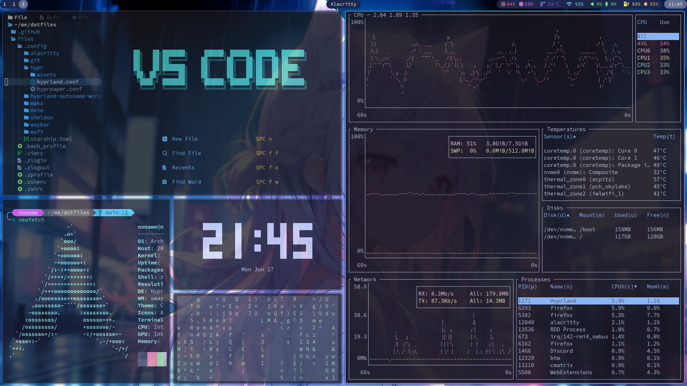

# 🧊 n4mlz's Dotfiles (new)

This is my Dotfiles repository managed by **chezmoi**, targeting **Arch Linux, Debian, and Ubuntu**!
This also provides a set of CLI tools, and can be deployed to SSH-accessible servers, WSL, or containers.



> [!NOTE]
> My previous Dotfiles were maintained in [n4mlz/dotfiles](https://github.com/n4mlz/dotfiles).

## 🌱 Environment

### 🖥️ GUI

- [Hyprland](https://github.com/hyprwm/Hyprland) _**(Window Manager)**_
- [hyprpaper](https://github.com/hyprwm/hyprpaper) _**(Wall Paper)**_
- [Waybar](https://github.com/Alexays/Waybar) _**(Status Bar)**_
- [wofi](https://hg.sr.ht/~scoopta/wofi) _**(Application Launcher)**_
- [mako](https://github.com/emersion/mako) _**(Notifications)**_
- [Alacritty](https://github.com/alacritty/alacritty) _**(Terminal Emulator)**_
- [Thunar](https://docs.xfce.org/xfce/thunar/start) _**(File Manager)**_
- [gtklock](https://github.com/jovanlanik/gtklock) _**(Lock Screen)**_
- [SwayOSD](https://github.com/ErikReider/SwayOSD) _**(OSD)**_
- [Catppuccin](https://github.com/catppuccin) _**(Theme)**_
- [cliphist](https://github.com/sentriz/cliphist) _**(Clipboard Manager)**_

### ⌨ CLI

- [zsh](https://www.zsh.org/) _**(Shell)**_
- [AstroNvim](https://github.com/AstroNvim/AstroNvim) _**(Text Editor)**_
- [sheldon](https://github.com/rossmacarthur/sheldon) _**(Zsh Plugin Manager)**_
- [Starship](https://github.com/starship/starship) _**(Prompt)**_
- [mise](https://github.com/jdx/mise) _**(Environment Setup Tool)**_
- [bat](https://github.com/sharkdp/bat) _**(replacement for `cat`)**_
- [eza](https://github.com/eza-community/eza) _**(replacement for `ls`)**_
- [zoxide](https://github.com/ajeetdsouza/zoxide) _**(replacement for `cd`)**_
- [bottom](https://github.com/ClementTsang/bottom) _**(replacement for `bottom`)**_

## ✅ Installation

The entire configuration is now managed by **chezmoi**.

To install, run the following commands:

```bash
$ chezmoi init n4mlz/dotfiles-new
$ chezmoi apply
```

Or, you can run the following command to install chezmoi and initialize it in one step:

```bash
$ curl -fsSL https://raw.githubusercontent.com/n4mlz/dotfiles-new/main/install.sh | sh
```

## 🔗 Dependencies

- [chezmoi](https://www.chezmoi.io/) _**(Dotfiles Manager)**_

## 🪶 Features

### ⚙️ Automatic CLI tool installation

CLI tool‑chain (such as **Starship**, **sheldon**, etc.) are installed automatically via chezmoi’s user‑script feature when you run `chezmoi apply`.

### 🛠️ CI‑based Installation Tests

GitHub Actions automatically verifies that these dotfiles install correctly on **Arch Linux**, **Debian**, and **Ubuntu** containers.

### 📱 Smart Screen Shot Operations

Implemented via **Hyprland**’s configuration, my Dotfiles provide a simple and efficient key‑binding scheme to define and execute screen capture areas and functionalities.

The following key combinations with the `PrtSc` key will execute a screen capture:

- `Shift`: Toggles between capturing the active window or the full screen
- `Ctrl`: Toggles between saving the capture or not
- `Alt`: Toggles between capturing a user-specified area or not

Additionally, the screen capture will always be saved to the clipboard, regardless of the above flags.

For example:

- `PrtSc`: Saves the active window to the clipboard
- `Shift` + `PrtSc`: Saves the full screen to the clipboard
- `Ctrl` + `Alt` + `PrtSc`: Saves a user-selected rectangular area to both the clipboard and a file

When saving to a file, the directory ~/me/pics/screenshot is automatically generated, with the subdirectory named after the current running process (e.g. ~/me/pics/screenshot/firefox).

## ✉ About me

- Twitter: [@n4mlz](https://x.com/n4mlz)
- GitHub: [@n4mlz](https://github.com/n4mlz)
- My Web Site: [n4mlz.dev](https://n4mlz.dev)
